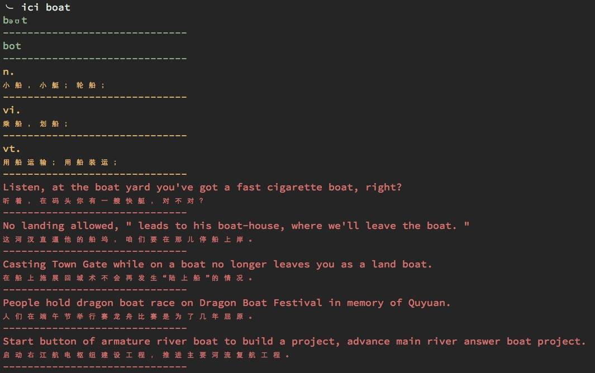

# ici

一款基于python的命令行查词工具, 使用金山词霸api。

###安装：

pip install ici

###使用方法：

$ ici what

[wɒt]

[wɑ:t]

pron. （用以询问某人或某事物的词）什么，多少；…的事物；

adj. …的（事物或人）；

adv. （用于感叹句中）；

int. （用以表示不相信或惊奇）；（用以表示未听清楚对方说的话）；

ex. Compare the use of which and what as determiners and pronouns in questions.
    试比较which和what用作限定词和代词时，在疑问句中的用法。

ex. We categorize functionally idiomsinto three types: ideational (e.g. Indian summer), interpersonal (e.g. What's up?)
    我们将习语搭配按其功能分为三类：概念搭配（如Indiansummer)，人际搭配（如What’s up?）

ex. The song is called What's Yr [your] Take on Cassavetes.
    歌名就是“What'syr[your]TakeonCassavetes”。

ex. The questions such as"why""what""how"have been answered.
    现有的研究基本上回答了有关语文课程资源建设的“为什么(why)”、“是什么(what)”及“怎么办(how)”的系列问题。

ex. Who, what, that, etc. are relatives.
    Who, what, that等是关系代词。

### 运行样例

### Other Versions

* Vim <https://github.com/Flowerowl/ici.vim>

* Golang <https://github.com/Flowerowl/ici.go>
